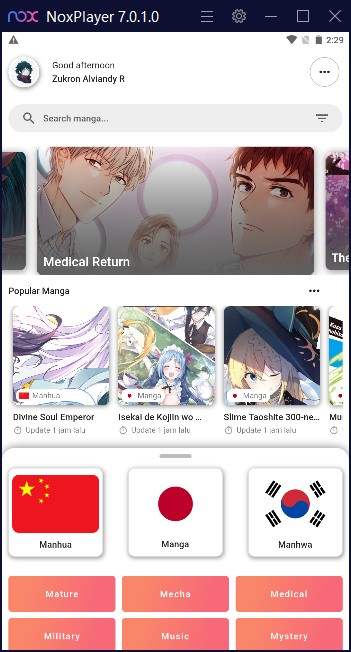
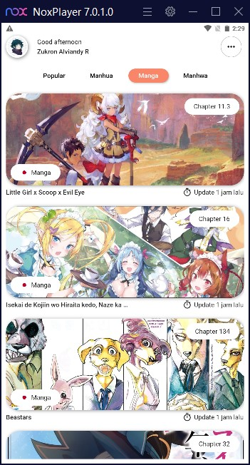
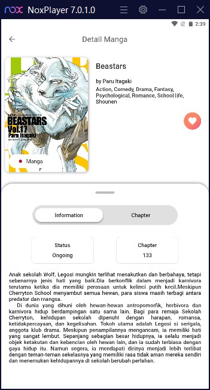

# Manga Nih

## Screenshots

<p align="center">
    
    
    
</p>

## Build

Edit file `local.properties` inside `Android` folder and add some line.

```
 flutter.minSdkVersion=21
 flutter.compileSdkVersion=31
 flutter.targetSdkVersion=31
```

## Lefthook

- To improve style and format code.
- Install [lefhook](https://github.com/evilmartians/lefthook).
- Add lefthook executable to path environment.
- Open Manga nih project and execute lefthook command.
  ```bash
  lefthook install
  ```

## Komiku SDK

- Install submodule
  ```bash
  git submodule update --init --recursive
  ```
- Checkout main
  ```bash
  git submodule foreach git checkout main
  ```
